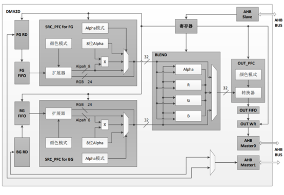
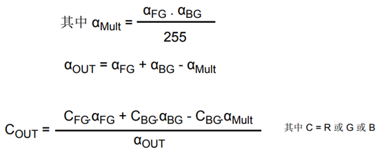

# 2D图形加速控制器DMA2D

## DMA2D模块基础知识

DMA2D是专用于图像处理的专业DMA。特别是刷单色屏，刷图片，刷Alpha（透明）混合效果全靠它，而且可以大大降低CPU利用率。

DMA2D主要实现了两个功能，一个是DMA数据传输功能，另一个是2D图形加速功能。

- DMA数据传输
主要是两种方式，一个是寄存器到存储器，另一个是存储器到存储器。通过DMA可以大大降低CPU的利用率。
- 2D图形加速功能
支持硬件的颜色格式转换和Alpha混合效果。

DMA2D可在以下四种模式下工作：

- 寄存器到存储器
- 存储器到存储器
- 存储器到存储器并执行像素格式转换
- 存储器到存储器并执行像素格式转换和混合

DMA2D模块结构框图如下所示：

## DMA2D前景层FIFO和背景层FIFO

DMA2D前景层FIFO和背景层FIFO获取要复制和/或处理的输入数据。

这些FIFO根据相应像素格式转换器PFC中定义的颜色格式获取像素。

通过如下一组寄存器对它们进行编程：

- DMA2D前景层存储器地址寄存器`FGMAR`
- DMA2D前景层偏移寄存器`FGOR`
- DMA2D背景层存储器地址寄存器 `BGMAR`
- DMA2D背景层偏移寄存器 `BGOR`
- DMA2D行数寄存器（行数和每行像素数）`NLR`

DMA2D在寄存器到存储器模式下工作时，不激活任何FIFO。

DMA2D在存储器到存储器模式下工作时（无像素格式转换和混合操作），仅激活FG FIFO，并将其用作缓冲区。

DMA2D在存储器到存储器模式下工作时并支持像素格式转换时（无混合操作），不会激活BG FIFO。

## DMA2D 前景层和背景层像素格式转换器 (PFC)

DMA2D前景层和背景层像素格式转换器 (PFC)执行像素格式转换，以生成每像素32位的值。PFC还能够修改alpha通道。

转换器在第一阶段转换颜色格式。前景层像素和背景层像素的原始颜色格式分别通过 `FGPFCCR`和`BGPFCCR`的CFMT [3:0] 位来配置。

颜色格式的编码方式如下：

- Alpha 值字段：0xFF对应不透明像素，0x00对应透明像素。
- R 字段代表红色
- G 字段代表绿色
- B 字段代表蓝色

如果原始格式不包括alpha通道，则会自动将alpha值设为0xFF（不透明）。

通过ARGB8888模式支持按32位对齐24位RGB888。

生成32位值后，即可根据`FGPFCCR`/`BGPFCCR`寄存器的AMODE [1:0]字段修改alpha 通道。

Alpha通道可以：

- 保持不变（不做修改）
- 替换为`FGPFCCR`/`BGPFCCR`的ALPHA[7:0]值
- 替换为原始alpha值与`FGPFCCR`/`BGPFCCR`的ALPHA [7:0]值的乘积除以255所得商。

## DMA2D混合器

DMA2D混合器成对混合源像素以计算结果像素。

混合将按以下公式执行：

混合器不需要任何配置寄存器。是否使用混合器取决于`CR`寄存器的MODE[1:0]字段中定义的DMA2D工作模式。

## DMA2D输出PFC

输出PFC将像素格式从32位转换为指定的输出格式，输出格式在DMA2D输出像素格式转换器配置寄存器`OPFCCR`的CFMT [2:0]字段中定义。

## DMA2D输出FIFO

输出FIFO根据输出PFC中定义的颜色格式对像素进行编程。

通过如下一组寄存器定义目标区域：

- DMA2D输出存储器地址寄存器 `OMAR`
- DMA2D输出偏移寄存器 `OOR`
- DMA2D行数寄存器（行数和每行像素数）`NLR`

如果DMA2D在寄存器到存储器模式下工作，则配置的输出矩形将以DMA2D输出颜色寄存器 (OCOLOR)中指定的颜色填充。

## DMA2D配置

DMA2D可在以下四种模式下工作，通过`CR`寄存器的MODE[1:0]位选择工作模式：

- 寄存器到存储器
- 存储器到存储器
- 存储器到存储器并执行PFC
- 存储器到存储器并执行PFC和混合

### 寄存器到存储器

寄存器到存储器模式用于以预定义颜色填充用户自定义区域。

颜色格式在`OPFCCR`中设置。

DMA2D不从任何源获取数据。它只将`OCOLOR`寄存器中定义的颜色写入通过`OMAR`寻址以及`NLR`和`OOR`定义的区域。

### 存储器到存储器

在存储器到存储器模式下，DMA2D不执行任何图形数据转换。前景层输入FIFO充当缓冲区，数据从`FGMAR`中定义的源存储单元传输到`OMAR`寻址的目标存储单元。

`FGPFCCR`寄存器的CFMT [3:0]位中编程的颜色模式决定输入和输出的每像素位数。

对于要传输的区域大小，源区域大小由`NLR`和`FGOR`寄存器定义，目标区域大小则由 `NLR`和`OOR`寄存器定义。

### 存储器到存储器并执行PFC

此模式下，DMA2D对源数据执行像素格式转换并将结果存储在目标存储单元。

对于要传输的区域大小，源区域大小由`NLR`和`FGOR`寄存器定义，目标区域大小则由`NLR`和`OOR`寄存器定义。

从FGMAR寄存器定义的位置获取数据，并由前景层PFC进行处理。原始像素格式通过 FGPFCCR寄存器配置。

在颜色转换执行期间，可根据`FGPFCCR`寄存器中编程的值添加或更改alpha值。如果原始图像没有alpha通道，则会自动添加一个默认的alpha值0xFF以获得完全不透明的像素。可根据`FGPFCCR`寄存器的AMODE [1:0]位修改alpha值：

- 保持不变。
- 替换为FGPFCCR寄存器的ALPHA[7:0]值中定义的值。
- 替换为原始值与FGPFCCR寄存器的ALPHA[7:0]值的乘积除以255所得商。

结果得到的32位数据由OUTPFC编码成`OPFCCR`寄存器的CFMT [2:0]字段所指定的格式。数据经处理后，将写入`OMAR`寻址的目标存储单元。

### 存储器到存储器并执行PFC和混合

此模式下，将在前景层FIFO和背景层FIFO（分别在`FGMAR`和`BGMAR`中定义）获取两个源图像。

必须按存储器到存储器模式中所述配置两个像素格式转换器。由于这两个像素格式转换器各自独立，因此其配置可以不同。在每个像素都通过相应的PFC转换为32位后，将根据上述公式进行混合：输出PFC将根据指定的输出格式对得到的32位像素值进行编码，并且编码数据将写入`OMAR`寻址的目标存储单元。
