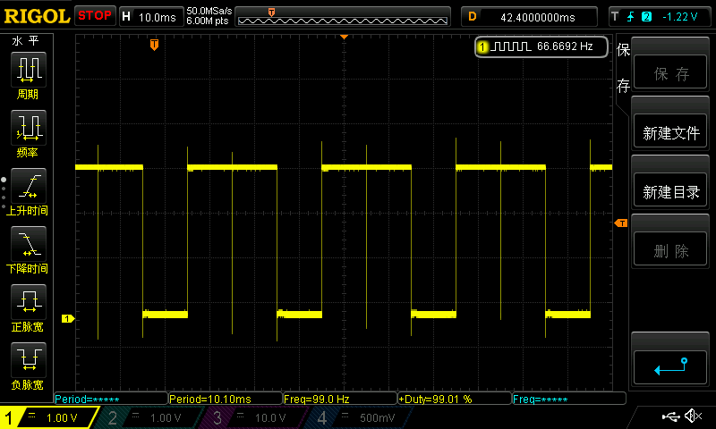
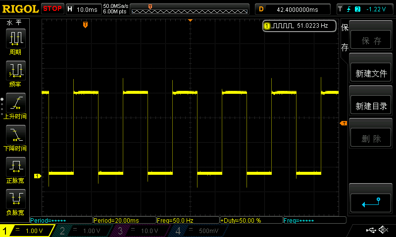

# 通用I/O GPIO

!!! 注意

    当GPIOx的16个引脚中，有些在主循环中操作，有些在中断ISR中操作时，GPIOx的引脚必须都用GPIO_Atomic类型函数操作，如果无特殊需求，请直接全部使用GPIO_Atomic类型函数操作。

## 例子

初始化GPIOA组的PIN10和PIN11，PIN10在主循环中执行置低操作，PIN11在TIMR4的10ms中断中执行翻转操作，分别使用**非GPIO_Atomic**和**GPIO_Atomic**类型函数操作，用示波器观察GPIOA11的波形。预期GPIOA11应该每10ms翻转一次。

## 错误情况

```c title="gpio_error.c" linenums="1" hl_lines="13 21"
int main(void)
{
    SystemInit();

    GPIO_Init(GPIOA, PIN10, 1, 0, 0, 0); //输出
    GPIO_Init(GPIOA, PIN11, 1, 0, 0, 0); //输出

    TIMR_Init(TIMR4, TIMR_MODE_TIMER, CyclesPerUs, 10000, 1);  //每10ms触发一次中断
    TIMR_Start(TIMR4);

    while(1==1)
    {
        GPIO_ClrBit(GPIOA, PIN10);
        // GPIO_AtomicClrBit(GPIOA, PIN10);
    }
}

void TIMR4_Handler(void)
{
    TIMR_INTClr(TIMR4);
    GPIO_InvBit(GPIOA, PIN11);
    // GPIO_AtomicInvBit(GPIOA, PIN11);
}
```



:scream: GPIOA不是10ms翻转一次！

## 正确情况

```c title="gpio_correct.c" linenums="1" hl_lines="14 22"
int main(void)
{
    SystemInit();

    GPIO_Init(GPIOA, PIN10, 1, 0, 0, 0); //输出
    GPIO_Init(GPIOA, PIN11, 1, 0, 0, 0); //输出

    TIMR_Init(TIMR4, TIMR_MODE_TIMER, CyclesPerUs, 10000, 1);  //每10ms触发一次中断
    TIMR_Start(TIMR4);

    while(1==1)
    {
        // GPIO_ClrBit(GPIOA, PIN10);
        GPIO_AtomicClrBit(GPIOA, PIN10);
    }
}

void TIMR4_Handler(void)
{
    TIMR_INTClr(TIMR4);
    // GPIO_InvBit(GPIOA, PIN11);
    GPIO_AtomicInvBit(GPIOA, PIN11);
}
```



:smiley: GPIOA每10ms翻转一次！

## 分析

使用非GPIO_Atomic类型函数操作出错的原因是不能保证引脚**读-改-写**操作原子性。

如果主循环中的GPIO操作进行到了**读**或者**读-改**还没有**写**的时候被中断打断了，在中断中执行完GPIO操作后返回主循环执行**写**操作，此时在中断执行的GPIO操作就可能会被覆盖掉，从而产生错误。