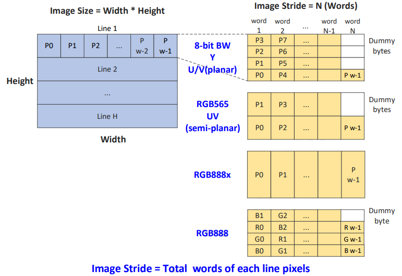
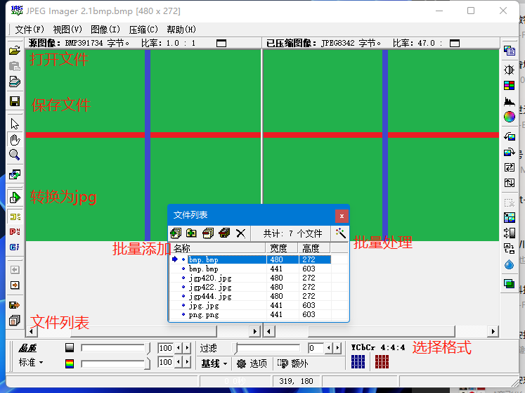
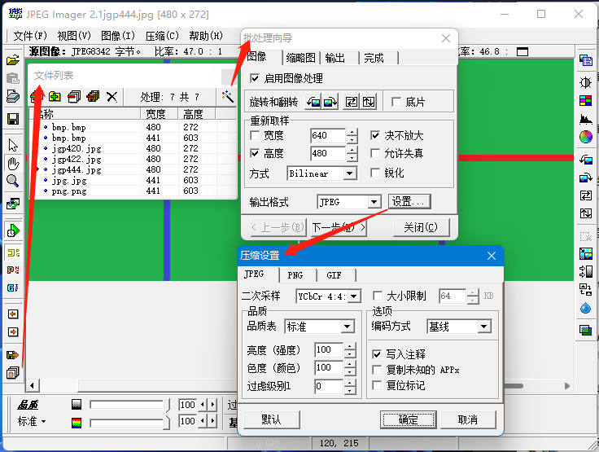
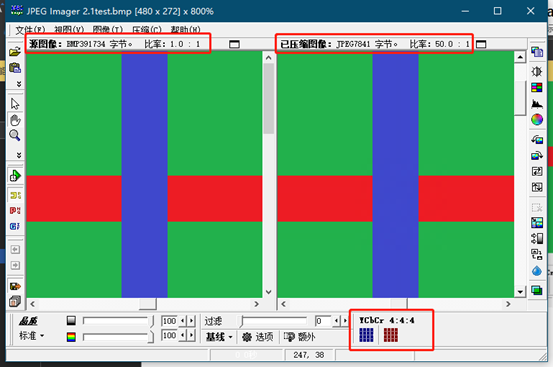
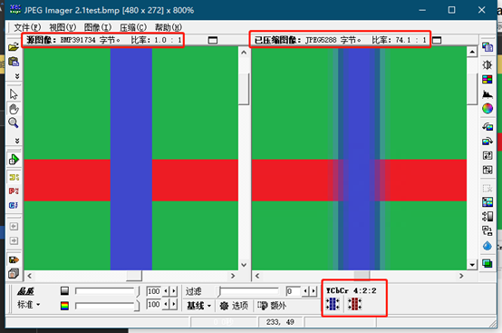
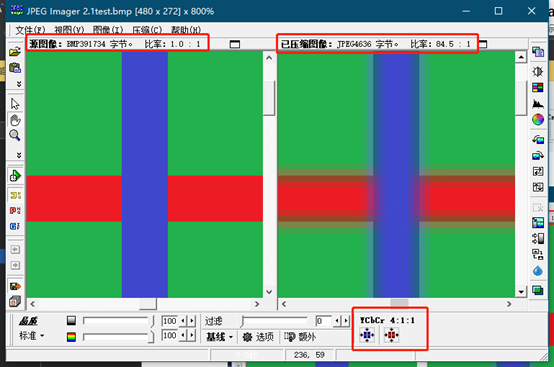
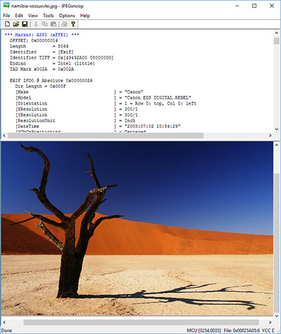

# JPEG解码器

- JPEG Profile:
    - Sequential DCT-based baseline process
    - 8-bit color depth (sample precision)
    - Up to 2 DC/AC Huffman tables
    - Up to 3 quantization tables
- Resolution:
    - Up to 1024 x 1024 pixels
    - Min. size: 1 MCU
- Image source format:
    - YUV420 (H2V2)
    - YUV422 (H2V1)
    - YUV444 (H1V1)
- Image scan mode:
    - Interleaved (3 components)
    - Non-interleaved (1 component)
- Others:
    - RST: Restart interval decoding
    - Support stream multi-buffering

## 图形stride配置

图像的输出数据流按照光栅序存储，每行所占的存储空间由`stride`设定，如下图：对于多片存储的格式（如 YUV planar、YUV semi-planar），则会有多个`stride`配置。

由上可知，JPEG解码模块的输出行与行之间可能不是连续的，取解码数据时要注意去掉无效数据。

## JPEGImager格式转换工具

如果不确定JPEG图片的详细格式，请先使用工具[JPEGImager](https://github.com/yanmowudi/diy-swm341/tree/master/tools/JPEG)进行转换再解码。

### 使用方法简介

详细使用方法请查看帮助文件

单张转换

批量转换

### 不同格式图片清晰度对比

YUV444,422,420清晰度由高到低，压缩率由低到高。

YUV444

YUV422

YUV420

## JPEGsnoop解码分析工具

[JPEGsnoop](https://github.com/yanmowudi/diy-swm341/tree/master/tools/JPEG)是一个详细的JPEG图像解码和分析工具。可以显示所有图像元数据，甚至可以帮助确定图像是否被编辑过。

[项目地址](https://github.com/ImpulseAdventure/JPEGsnoop)

