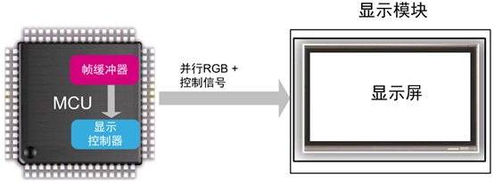
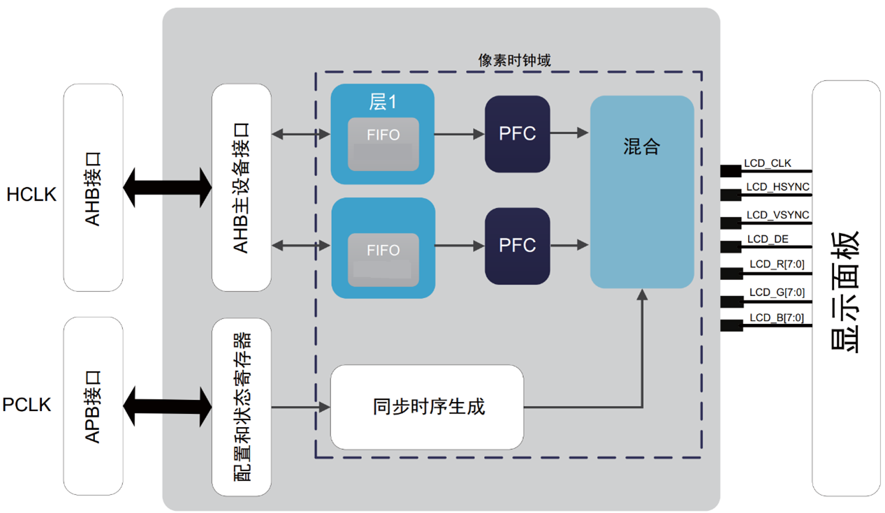
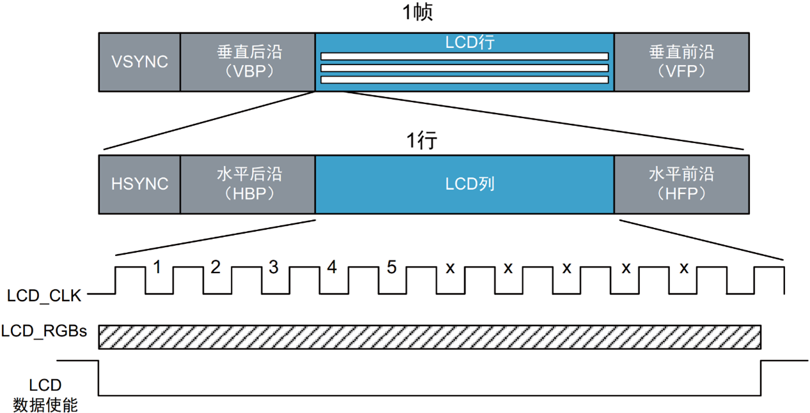
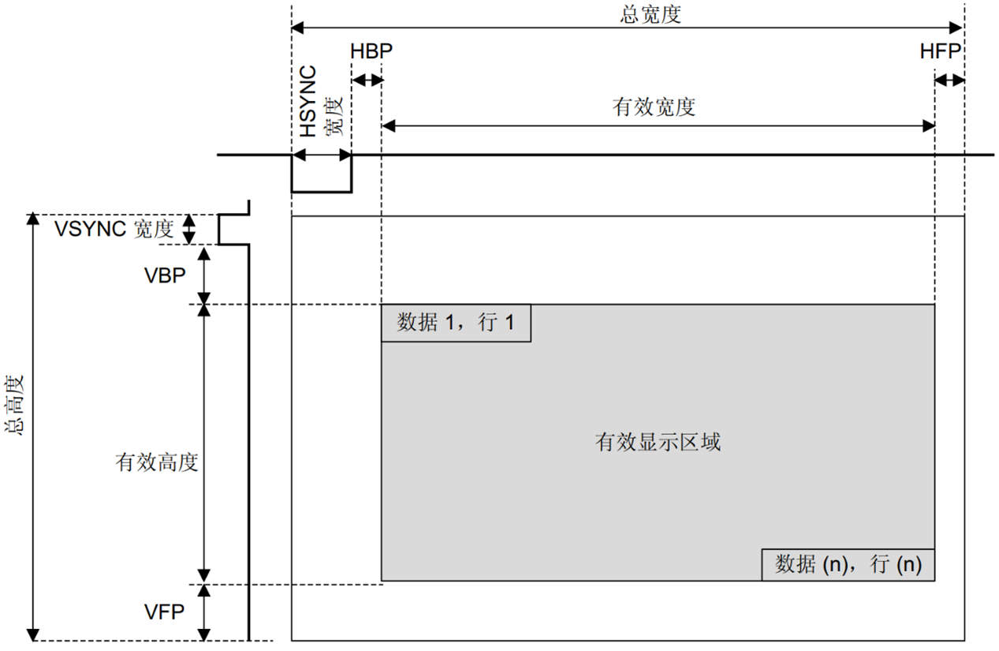
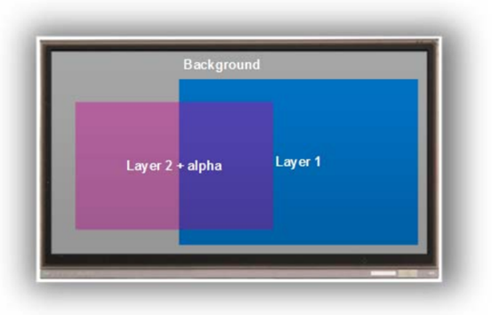

# LCD-TFT图形控制器

## 基本概念介绍

LCDC模块用于实现MCU与外部LCD的对接，在MCU的控制下，将需要显示的数据传送到外部LCD接口显示。

一个基本嵌入式图形系统可简化为如图所示。



基本嵌入式图形系统由微控制器、帧缓冲器、显示控制器和显示屏组成。

- 微控制器对要在帧缓冲器中显示的图像进行计算，以组成图标或图像等图形基元。CPU通过运行图形库软件来执行此过程。该过程可以由图形库使用专用硬件（如DMA2D）来加速。帧缓冲器更新的频率越高，动画越流畅（动画每秒帧数）。
- 帧缓冲器是一个易失性存储器，用于存储要显示图像的像素数据。该存储区通常称为图形RAM（GRAM）。所需帧缓冲器大小取决于显示器的分辨率和色深。双缓冲技术使用两个帧缓冲器，可以避免显示正在写入帧缓冲器的内容。
- 显示控制器持续“刷新”显示器，以每秒60次（60Hz）的速度将帧缓冲器内容传送到显示屏。显示控制器嵌入在MCU中。
- 显示屏由显示控制器来驱动，并负责显示图像（由像素矩阵组成）。
- 显示器特性为：
    - 显示尺寸（分辨率）：由显示像素数定义，表示为水平（像素数）×垂直（行数）。
    - 色深：定义可以绘制像素的颜色数量。它以每像素位数（bpp）来表示。对于24 bpp的色深（也可以用RGB888表示），一个像素可以有16777216种颜色表示。
    - 刷新率（以Hz为单位）：显示面板每秒刷新的次数。因为刷新率较低时产生的视觉效果不佳，所以显示器每秒钟刷新60次（60 Hz）。

## LCDC介绍

LCDC是AHB架构上的主设备，可以对内部和外部存储器进行读访问。LTDC有两个独立的层，每层都有自己的FIFO，从而使显示更加灵活。

LTDC控制器以AHB总线速度自动从帧缓冲器提取图形数据。然后将图形数据存储在其中一个FIFO内部层中，随后驱动到显示器。

该系统架构使图形可以在没有任何CPU介入的情况下构建并绘制到屏幕上。LTDC从帧缓冲器中检索属于图像的数据，而DMA2D则准备下一张图像。

在每个像素时钟上升沿或时钟下降沿，并在屏幕有效区域内，LCDC层从其FIFO中检索一个像素数据，将其转换为内部ARGB8888像素格式，并将其与背景和/或其他图层像素颜色进行混合。得到的像素以RGB888格式编码，然后被驱动到RGB接口中。像素便会显示到屏幕上。



为了驱动LCD-TFT显示器，LTDC利用简单的3.3V信号提供了多达28个信号，包括： • 像素时钟LCD_CLK信号用作LCD-TFT的数据有效信号。只有在LCD_CLK上升沿或下降沿才会显示该数据。
- 数据使能LCD_DE信号向LCD-TFT指示RGB总线中的数据是有效的，并且该数据必须被锁存才能绘制出来。
- LCD_HSYNC行同步信号管理水平线扫描，作为行显示选通。
- LCD_VSYNC帧同步信号管理垂直扫描，作为帧更新选通。
- 像素数据RGB888。可以对LTDC界面进行配置，使之输出多种色深。它最多可以使用24条数据线（RGB888）作为显示接口总线。

## 典型LCDC显示帧控制时序



LCDC外设允许用户连接任意显示器尺寸，总宽度可达1024像素，总高度可达1024行。图中说明了完全可编程的时序和分辨率。



图中各参数分别对应LCD_InitStructure结构体中各参数配置。

``` c title="lcd_init.c" linenums="1"
    LCD_InitStructure LCD_initStruct;

    LCD_initStruct.ClkDiv = 8;               //取值范围2--65
    LCD_initStruct.Format = LCD_FMT_RGB888; // LCD_FMT_RGB565、LCD_FMT_RGB888、LCD_FMT_SRGB565、LCD_FMT_SRGB888
    LCD_initStruct.HnPixel = LCD_HDOT;      // 水平方向像素个数，最大取值1024
    LCD_initStruct.VnPixel = LCD_VDOT;      // 垂直方向像素个数，最大取值1024

    LCD_initStruct.Hfp = 5;        // horizonal front porch，最大取值64
    LCD_initStruct.Hbp = 40;       // horizonal back porch， 最大取值256
    LCD_initStruct.Vfp = 8;        // vertical front porch， 最大取值64
    LCD_initStruct.Vbp = 8;        // vertical back porch，  最大取值256
    LCD_initStruct.HsyncWidth = 5; // HSYNC低电平持续几个DOTCLK，最大取值256，至少比Hbp少1
    LCD_initStruct.VsyncWidth = 5; // VSYNC低电平持续几个行时间，最大取值256，至少比Vbp少1

    LCD_initStruct.DataSource = (uint32_t)LCD_Buffer; // 显示数据地址
    LCD_initStruct.Background = 0xFFFF;                // 背景颜色
    LCD_initStruct.SampleEdge = LCD_SAMPLE_FALL;      // 屏幕在DOTCLK的哪个边沿采样数据：LCD_SAMPLE_RISE、LCD_SAMPLE_FALL
    LCD_initStruct.IntEOTEn = 0;                       // 传输完成中断使能

    LCD_Init(LCD, &LCD_initStruct);
```

## 两个可编程LCDC图层

LCDC有两层，每层都可以分别启用、禁用和配置。图层显示的顺序是固定的，始终是由下至上的。如果使能两个层，则层2为顶部显示窗口。

LCDC具有可配置的混合因数。混合始终使用alpha值来激活。混合顺序固定，即由下至上。如果使能了两层，首先第1层将与背景色混合，随后第2层与第1层和背景的混合颜色结果再次混合。



## 灵活的窗口位置和尺寸配置

每个图层都可在运行时进行定位和调整大小，并且必须位于有效显示区域内。可编程的图层位置和尺寸定义了一行中的第一个/最后一个可见像素和窗口中的第一个/最后一个可见行。它可以显示完整图像（所有有效显示区域）或仅显示图像帧的一部分。图示了一个小窗口，其中只显示图像的一部分，而其余区域不显示。


图中各参数分别对应LCD_InitStructure结构体中各参数配置。

``` c title="lcd_layer.c" linenums="1"
    LCD_LayerInitStructure LCD_layerInitStruct;
    LCD_layerInitStruct.Alpha = 0xFF;
    LCD_layerInitStruct.HStart = 0;
    LCD_layerInitStruct.HStop = 127;
    LCD_layerInitStruct.VStart = 0;
    LCD_layerInitStruct.VStop = 127;
    LCD_layerInitStruct.DataSource = (uint32_t)LCD_Buffer1;
    LCD_LayerInit(LCD, LCD_LAYER_1, &LCD_layerInitStruct);
```
这样我们就把屏幕给驱动起来了。🎉🎉🎉